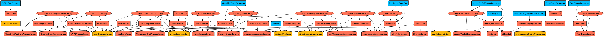
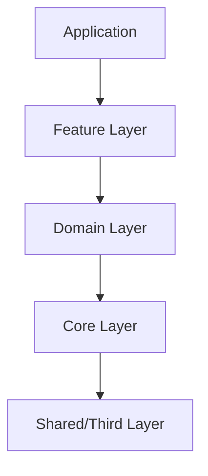
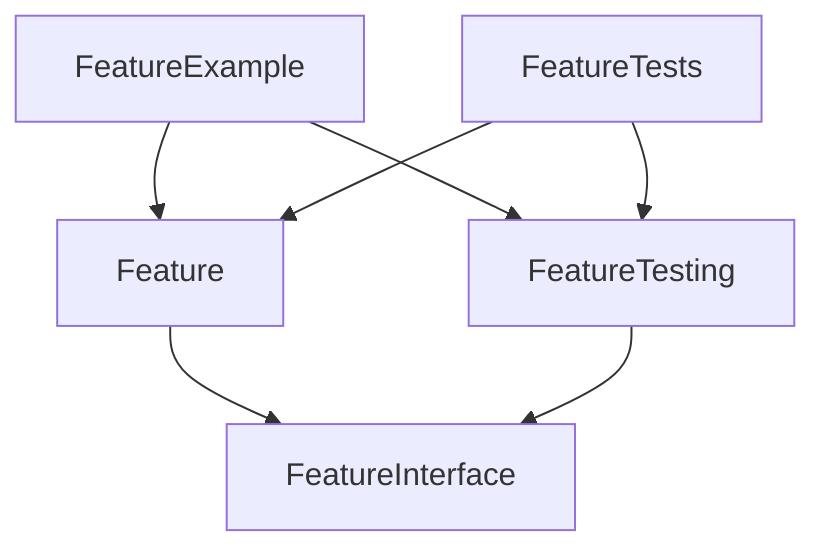

# Architecture
### Clean Architecture

- Presentation -> Domain <- Data 형태를 사용합니다. [(링크)](https://bitloops.com/docs/bitloops-language/learning/software-architecture/clean-architecture)


<details>
<summary>추가 설명</summary>
<div markdown="1">

- 
  - 도메인 모듈
  - Input / Output protocol


- 
- 클린아키텍처 그림 34.8
  - Layer 방식
  - 가장 마지막 방식을 사용합니다.
  - App -> Feature(Controller) -> Domain (Domain + Data) -> Core

</div>
</details>

### Dependency Graph


### Layer


### TMA
- The Modular Architecture (TMA)[(링크)](https://docs.tuist.dev/en/guides/develop/projects/tma-architecture)를 지향합니다.




# 프로젝트 사용법
프로젝트를 실행하고 관리하기 위해서는 [Tuist](https://docs.tuist.io/guides/quick-start/install-tuist) 환경 구성이 필요합니다.
mise를 설치한 다음 `mise install tuist`를 통해 Tuist를 설치합니다.

**프로젝트 실행 방법**
```bash
$ tuist install # Package Downlaod
$ tuist generate # Generates Xcode project & workspace
```

**프로젝트 편집 방법**
```bash
$ tuist edit 
```

# Framework
### UI
- [SnapKit](https://github.com/SnapKit/SnapKit.git)
- [Kingfisher](https://github.com/onevcat/Kingfisher.git)

### Network
- [Alamofire](https://github.com/Alamofire/Alamofire.git)
- [Moya](https://github.com/Moya/Moya.git)

### Rx
- [RxSwift](https://github.com/ReactiveX/RxSwift.git)
- [ReactorKit](https://github.com/ReactorKit/ReactorKit.git)

### Local
- [realm-swift](https://github.com/realm/realm-swift.git)

### DI
- [Swinject](https://github.com/Swinject/Swinject.git)

### Testable
- [Fakery](https://github.com/vadymmarkov/Fakery)
- [swiftdotenv](https://github.com/noahkamara/swiftdotenv)
